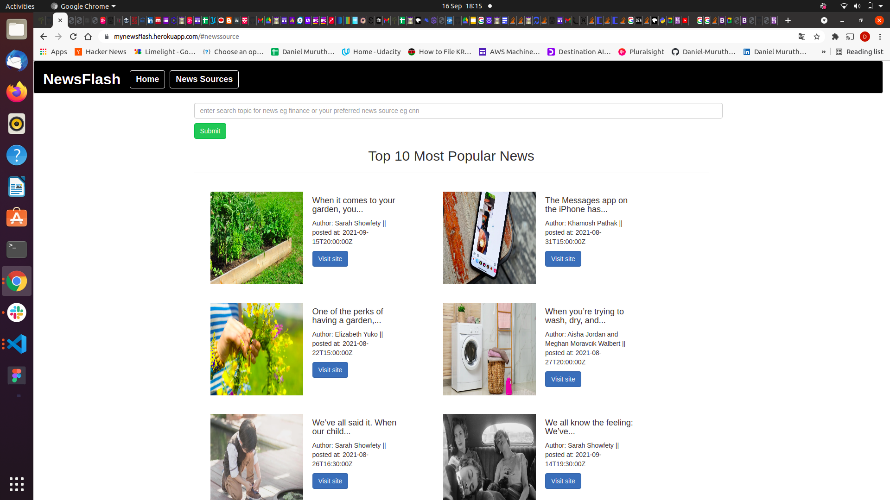

# NewsFlash

### Its a news website that displays latest popular news and offers a user the ability to search news based on categories eg bitcoin, sports etc or based on your news source eg cnn, abc etc

#### By **Daniel Muruthi**

## Description

Its a Flask web application that enables users to view and search for news from any media group. It displays latest popular news and offers a user the ability to search news based on categories eg bitcoin, sports etc.

## News Sources

## Results

#### results for espn/ESPN

## Setup/Installation Requirements

- Visual Studio Code
- Linux Terminal
- Github
- Heroku
- Flask virtual Environment
- NewsApi

## Known Bugs

None observed so far

## Limitations
There is a number of requests that you cannot go beyond while uding the NewsApi as it eventually leads to an error 429 and 503 and as such the link may not work for 24 hours

## Technologies Used

This project has been written using html, css, python languages and flask frameworks

## installations

Create a virtual environment and proceed to add the dependancies

- python3 -m venv --without-pip virtual
- curl https://bootstrap.pypa.io/get-pip.py | python
- source virtual/bin/activate
- pip install flask
- pip install flask-bootstrap
- pip install flask-script
- python3 -m  pip install gunicorn
- install Heroku cli

## Support and contact details

email: adinomuruthi1@gmail.com

### License

MIT License

Copyright (c) [2021] [Daniel Muruthi]

Permission is hereby granted, free of charge, to any person obtaining a copy
of this software and associated documentation files (the "Software"), to deal
in the Software without restriction, including without limitation the rights
to use, copy, modify, merge, publish, distribute, sublicense, and/or sell
copies of the Software, and to permit persons to whom the Software is
furnished to do so, subject to the following conditions:

The above copyright notice and this permission notice shall be included in all
copies or substantial portions of the Software.

THE SOFTWARE IS PROVIDED "AS IS", WITHOUT WARRANTY OF ANY KIND, EXPRESS OR
IMPLIED, INCLUDING BUT NOT LIMITED TO THE WARRANTIES OF MERCHANTABILITY,
FITNESS FOR A PARTICULAR PURPOSE AND NONINFRINGEMENT. IN NO EVENT SHALL THE
AUTHORS OR COPYRIGHT HOLDERS BE LIABLE FOR ANY CLAIM, DAMAGES OR OTHER
LIABILITY, WHETHER IN AN ACTION OF CONTRACT, TORT OR OTHERWISE, ARISING FROM,
OUT OF OR IN CONNECTION WITH THE SOFTWARE OR THE USE OR OTHER DEALINGS IN THE
SOFTWARE.
Copyright (c) {2021}